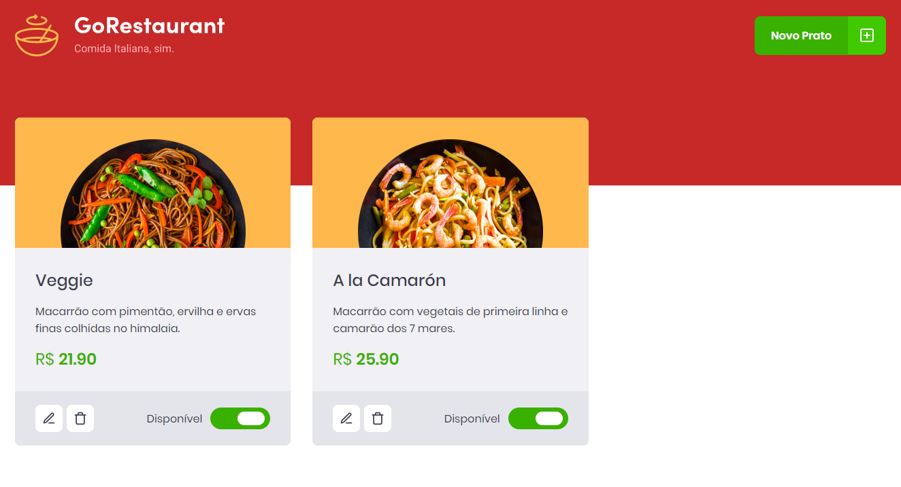

# GoRestaurant
Este repositório é referente ao desafio 'CRUD React' do Bootcamp GoStack 11.0, da Rocketseat 🚀.


# Resultado 🚀
<p align="center">
  
</p>

# Tecnologias Utilizadas 🚀
React ⚛️ <br />
React Modal ⚛️ <br />
Styled-Components 💅🏻 <br />
Jest 🃏 <br />
React Icons ⚛️❤️ <br />
Typescript 🦕

# Testes 🧪
Testes Unitários feito com Jest
Para inicializar todos os testes já prepardos, utilize <code> yarn test </code>.

# Como rodar? 🤔
Siga os passos:

```
    yarn
    npm i -g json-server
    json-server server.json -p 3333
    yarn start

```
Happy Hacking! 🚀

⚠️ Caso o projeto não mostre os produtos, rode <code>adb reverse tcp:3333 tcp:3333</code> antes de iniciar a Fake API ⚠️

# Como Contribuir? 😍
**Faça um fork deste repositório**

```bash
# Clone o seu fork
$ git clone url-do-seu-fork && cd nome-do-projeto

# Crie uma branch com sua feature ou correção de bugs
$ git checkout -b minha-branch

# Faça o commit das suas alterações
$ git commit -m 'minhas alterações'

# Faça o push para a sua branch
$ git push origin minha-branch
```

Delete sua branch, se quiser, quando o merge da sua pull request for feito. <br />

Feito com 💜 por <a href="https://www.linkedin.com/in/victorcmarinho/" target="blank">victorcmarinho</a>.
